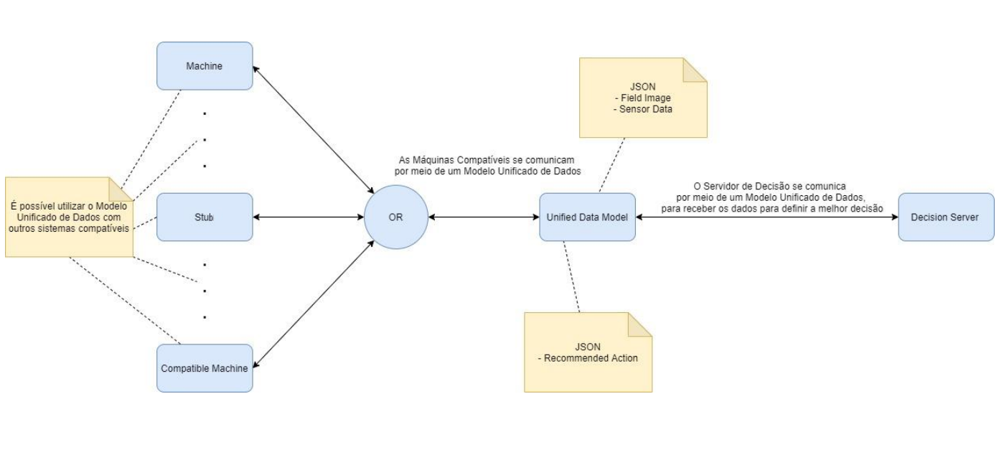

# Pebolim Unified data Model

O Pebolim Unified Data Model (PUDM) é uma modelagem de dados criada para permitir a utilização de diversos Machine Controllers na arquitetura da mesa de pebolim. A ideia deste modelo de dados surge a partir do conceito de Interface nas linguagem de programação orientadas a objetos, onde esta representa uma estrutura que funciona como um contrato, garantindo que as classes que a pertencem implementem determinados métodos. O PUDIM faz este papel de contrato, porém para os sistemas envolvidos na mesa de pebolim automatizada, governando como deve ser feita a comunicação entre o controlador desta mesa com o Servidor de Decisão e garantindo a compatibilidade entre os sistemas.



## Definição de comunicação

O PUDM funciona em uma arquitetura cliente-servidor, envolvendo sistemas compatíves com o protocolo de comunicação. A comunicação é feita por meio de sockets e requisições HTTP. No caminho do cliente para o servidor são utilizadas requisiões HTTP em modo POST, na direção servidor para cliente é utilizada a tecnologia SocketIO.

Ambos os caminhos de comunicação devem transmitir o JSON de evento.

### Convenções de Dados

#### Mesa
Como o PUDM representa dados reais, precisamos padrozinar as marcações de referência, por isso, sempre consideramos que a mesa de pebolim será retangular e representada da seguinte forma:


```plaintext

    0,y ************************************************* x,y
        *************************************************
        *************************************************
        *************************************************
        G***********************************************G
maquina O***********************************************O  humano
        L***********************************************L
        *************************************************
        *************************************************
        *************************************************
        *************************************************
    0,0                                                   x,0

```

#### Motores

O lado clinte do PUDM deve garantir que a posição inicial de um motor seja:
- Motores de rotação: boneco virado para baixo, perpendicular a mesa
- Motores de movimento: A posição das hastes deve estar exatamente no meio da movimentação possível para a haste. No caso de uma linha com quantidade impar de bonecos, o boneco do meio deverá estar na posição do centro. Em caso de linha de quantidade par o ponto central entre os dois bonecos centrais deve estar no centro.

### PUDMServer

Lado servidor do PUDM, deve disponibilizar um endpoint de socket na tecnologia SocketIO para que o Cliente se conecte e possa receber eventos. Além disso, deve disponibilizar um endpoint de API para receber as requisições HTTP Post com eventos. Antes de aceitar uma conexão de um cliente, deve verificar se os dados da versão são compatíveis.

Envia os eventos:
- ActionEvent


### PUDMCliente

Lado Cliente do PUDM, deve ser conectado ao PUDMServer antes de iniciar execução.

Envia os eventos:
- RegisterEvent
- StatusUpdateEvent


### Eventos

Os eventos são as mensagens enviadas por meio do socket. Eles enviam sua estrutura de dados no formato JSON. Dados comuns a todos os eventos:

```javascript

{
    "timestamp": int,
    "version": int,
    "eventType": string
}

```
Descrição dos campos:
- Timestamp: momento em que o evento foi gerado
- Version: versão do PUDM
- eventType: string representando o tipo do evento

#### EventTypes

Um EventType é a definição de o que determinado evento representa. Observe que todas as descrições a seguir contém os dados base citados anteriormente.

#### RegisterEvent

```javascript

{
    "evenType": "register",
    "fieldDefinition": {   // contem definições do campo de jogo
        "dimensions": [float, float], // largura e comprimento (cm)
        "lanes": [ // lsita que contem a descrição de cada linha controlada pela maquina (cada elemento representa uma linha)
            {
                "laneID": int, // id da linha, a linha mais próxima do gol da maquina é a linha 0
                "xPosition": float // posição X da linha (fixo para a haste)
                "playerCount": int // quantidade de jogadores na linha (deve ser maior ou igual a 0)
                "playerDistance": float // distancia em Y entre dois jogadores na linha (ignorado caso exista apenas 1 jogador)
                "movementLimit": float // distancia de movimentação possível no eixo Y da haste em relação à posição inicial 
            },
            ...
    ]
    },
    "cameraSettings": { // informações da camera integrada a mesa
        "framerate": int,
        "resolution": [int, int]
    }
}

```

Observação: este evento precisa ser enviado com ACK, enquanto não receber confirmação do ACK, reenviar.

#### StatusUpdateEvent


```javascript

{
    "evenType": "status_update",
    "camera": {
        "image": string  // bytes da imagem codificados em uma string por meio de um encoder base64
    },
    "lanes": [ // lista contendo o estado de cada linha controlada pela maquina, cada elemento representa uma linha
        {
            "laneID": int, // id da linha
            "currentPosition": float // posição Y atual da linha, em relação a posição inicial
            "rotation": float // rotação atual da linha, sendo 0º o boneco na posição inicial
        },
        ...
    ]

}

```

#### ActionEvent

```javascript

{
    "evenType": "action",
    "desiredState": [ // estado que o PUDMServer deseja para a mesa, cada elemento é um comando para uma linha
                      // não é obrigatório ter um elemento para cada linha  
        {
            "laneID": int, // id da linha que este comando afeta
            "position": float, // posição para onde a linha deve se mover, em Y, sendo 0 a posição inicial
            "kick": bool // informa se a linha deve iniciar um comando de chute
        },
        ...
    ]
}

```

Comportamento: O PUDMClient sempre tentará chegar ao estado desejado mais recente e manter sua posição.
